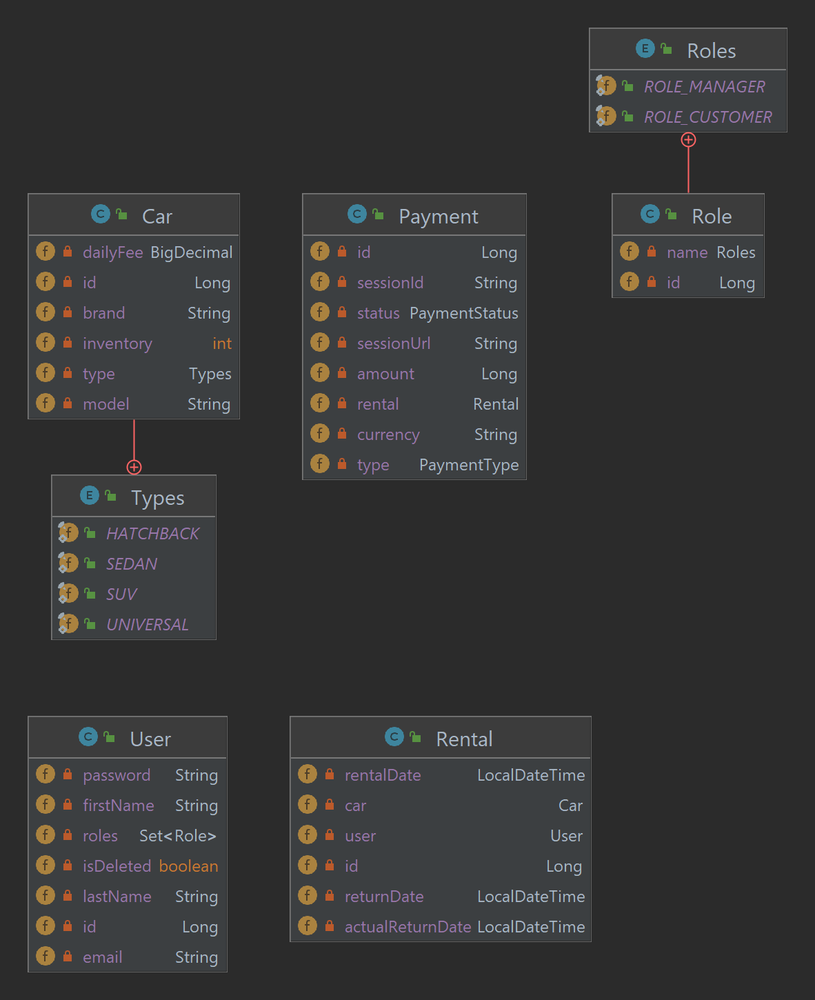

# Car Sharing App 🚗

A Spring Boot–powered backend for a simple car‐rental service. With role-based security, Stripe integration for payments, and Telegram notifications, this project demonstrates a production-ready REST API.

---

## Features

## 🚀 Features

- **Role-Based Access Control**  
  The system supports different roles such as `CUSTOMER` and `MANAGER`, with secure access restrictions on API endpoints based on user roles using Spring Security.

- **Authentication and Registration**  
  Users can register and log in securely using JWT-based authentication. Passwords are encrypted using BCrypt for added security.

- **Car Management**  
  Managers can create, update, and delete car entries. Each car includes details such as model, brand, type, inventory count, and daily rental fee.

- **Rental Process**  
  Customers can view available cars and create rental orders. Upon returning a car, the system updates the inventory and calculates penalties if returned late.

- **Rental History & Status Tracking**  
  Users can view their active and past rental history, including actual return dates and rental periods.

- **Payment Integration via Stripe**  
  Stripe is integrated for secure online payments. Users can initiate a Stripe session, and the backend handles both success and cancellation callbacks.

- **Fine Calculation**  
  Late returns are automatically penalized by multiplying the base fee with a configurable fine multiplier.

- **Order Notifications via Telegram Bot**  
  Managers receive Telegram notifications when rentals are created or returned, enabling real-time tracking and customer service.

- **User Profile Management**  
  Users can view and update their profile. Managers can update roles of other users.

- **Swagger API Documentation**  
  All endpoints are documented using Swagger/OpenAPI, accessible via a UI for easy testing and exploration.

---

## 🛠️Tech Stack

| Layer              | Technology                    |
|--------------------|-------------------------------|
| Framework          | Spring Boot 3.x               |
| Security           | Spring Security               |
| Data Access        | Spring Data JPA (Hibernate)   |
| Database           | H2 (test) / MySQL (prod)      |
| Payments           | Stripe Java SDK               |
| Notifications      | Telegram Bot API              |
| API Docs           | Springdoc-OpenAPI (Swagger)   |
| Testing            | JUnit5, Mockito, MockMvc      |
| Build & CI/CD      | Maven / GitHub Actions        |

---
## 📦 Getting Started

Prerequisites
* Java 17+

* Maven 3.6+

* MySQL (or use embedded H2 for quick start)

* Stripe account & API keys

* Telegram bot token & chat ID

Clone the repository
```bash
git clone https://github.com/Oleksa-32/car-sharing-app
cd car-sharing-app
```
Configure application properties
Copy it in yours .env file

| Key                      | Value      |
|--------------------------|------------|
| MYSQLDB_ROOT_PASSWORD    | password   |
| MYSQLDB_USER             | username   |
| MYSQLDB_PASSWORD         | password   |
| MYSQLDB_DATABASE         | database   |
| MYSQLDB_HOST_PORT        | 3307       |
| MYSQLDB_CONTAINER_PORT   | 3306       |
| SPRING_HOST_PORT         | 8088       |
| SPRING_CONTAINER_PORT    | 8080       |
| DEBUG_PORT               | 5005       |
| STRIPE_SECRET_KEY        | secret_key |
| FINE_MULTIPLIER          | number     |
| TELEGRAM_BOT_TOKEN       | token      |
| TELEGRAM_CHAT_ID         | id         |

Docker Compose: Open your terminal and use 
```bash
docker compose build 
docker compose up.
```

After Startup

Once containers are running:

API Base URL: http://localhost:8088

Swagger UI: http://localhost:8080/swagger-ui/index.html

# API Endpoints

Postman collection: [postman_collection.json](postman_collection.json)

## /cars
- `GET /cars` – Get all cars (Customer access)
- `GET /cars/{id}` – Get a car by ID (Customer access)
- `POST /cars` – Create a new car (Manager access)
- `PUT /cars/{id}` – Update an existing car (Manager access)
- `DELETE /cars/{id}` – Delete a car (Manager access)

## /rentals
- `GET /rentals/{id}` – Get rental by ID (Customer access)
- `GET /rentals?user_id={id}&is_active={true/false}` – Get user's active/inactive rentals (Customer access)
- `POST /rentals` – Create a rental (Manager access)
- `POST /rentals/{id}/return` – Return a rented car (Customer access)

## /payments
- `GET /payments?user_id={id}` – Get all payments for a user (Customer access)
- `POST /payments` – Create a Stripe payment session (Customer access)
- `GET /payments/success?session_id={id}` – Handle successful Stripe payment (Customer access)
- `GET /payments/cancel?session_id={id}` – Handle Stripe payment cancellation (Customer access)

## /auth
- `POST /auth/registration` – Register a new user
- `POST /auth/login` – Login an authenticated user

## /users
- `GET /users/me` – Get current user's profile (Authenticated users)
- `PUT /users/me` – Update current user's profile (Authenticated users)
- `PUT /users/{id}/role` – Update user's role (Manager access)

# Entity Diagrams
